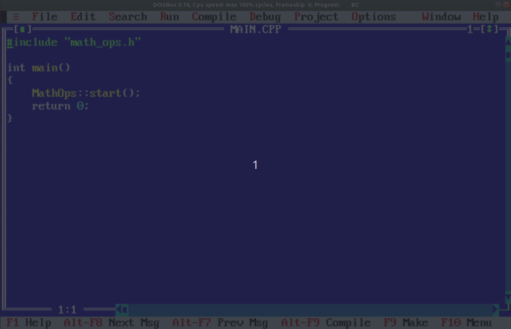

# beginnings

Some C/C++ stuff from my early days! [2003 - '04]

IDE: Borland C++ 3.1

I was learning C and exploring the documentation of Borland C++ 3.1, experimenting and trying to create things. At that time, with very limited access to the Internet and other study resrouces, I had no idea about any third-party libraries/frameworks e.g. curses/ncurses, object-oriented programming (OOP), data structures, multi-threading, design patterns, best practices, etc. I had to learn some OOP after a discussion on solving fractions with my teacher which led me to C++.

**NOTE**: This code might have bugs! I tried to clean it a bit before pushing.

## Matrix Falling Code - My Version :)

Yes, I love Matrix! <3

Code: [`MATRIX.CPP`](code/matrix/MATRIX.CPP)

</img>

## Text-based User Interface (TUI) for a Terminal / Shell Emulator

Code: [`DOS.CPP`](code/dos/DOS.CPP)

</img>

## MathOps (menu-based TUI)

Code: [`math-ops`](code/math-ops/)

**NOTE**: Use DOS (CP437) encoding if the correct ASCII special characters are not visible in the editor. Check the [compressed code](code/math-ops/math-ops.zip) if there's somoething wrong with the ASCII art in the uploaded code.

</img>

# Contact

Email: azeem.sajid@gmail.com
LinkedIn: https://www.linkedin.com/in/az33msajid

# License

[Apache 2.0](LICENSE)
